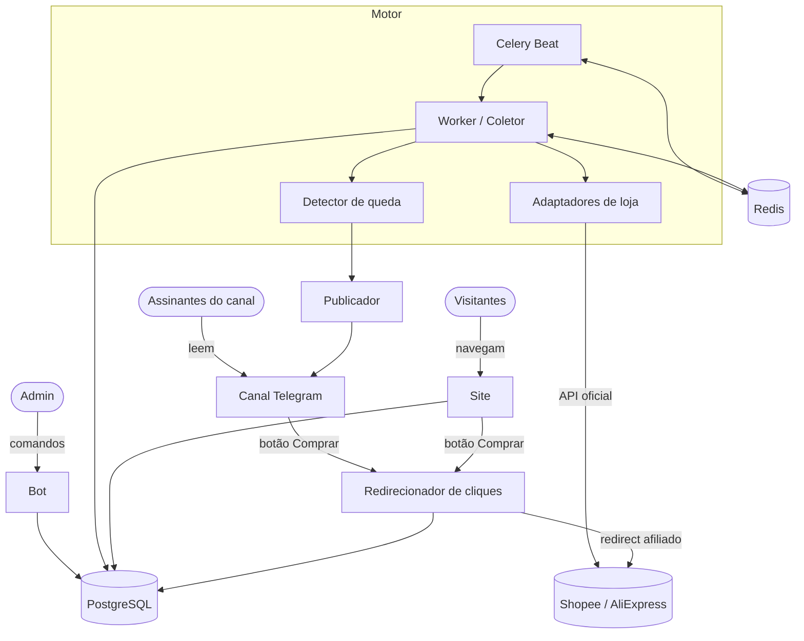
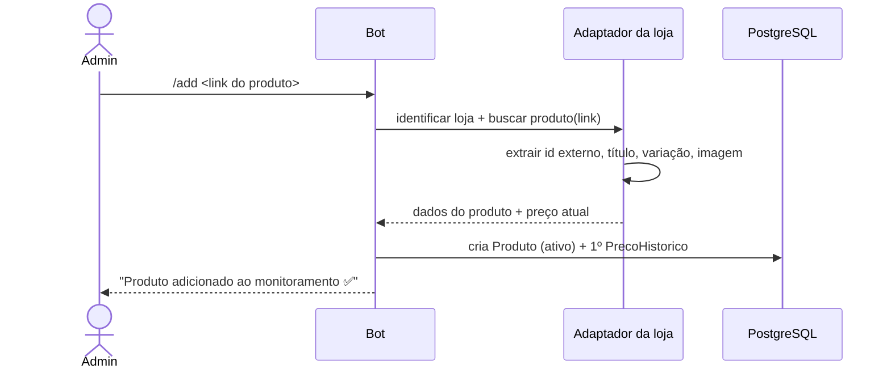
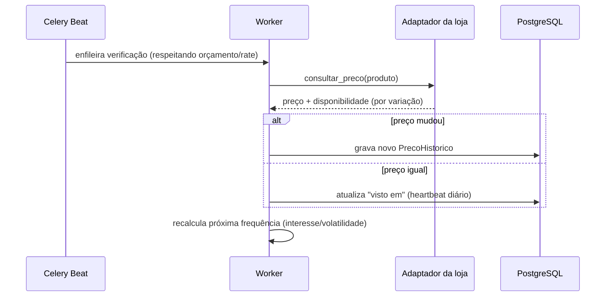
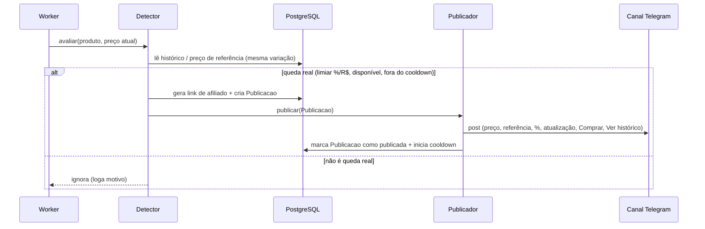
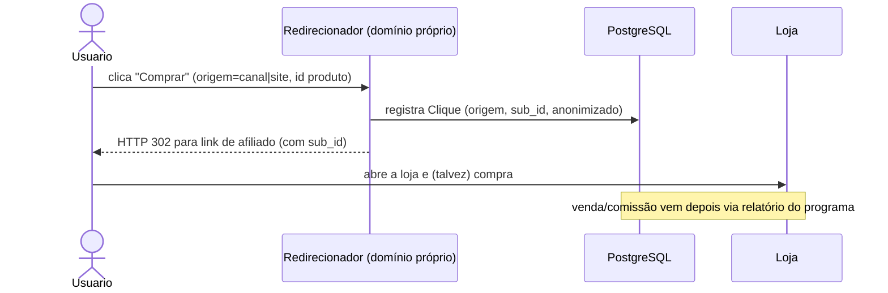

# 03 — Arquitetura

Visão dos componentes, dos fluxos principais (diagramas Mermaid) e da infraestrutura (deploy em Docker, DNS, HTTPS, backups, logs e monitoramento). O núcleo é um **motor** de coleta/histórico/detecção; lojas e canais são **adaptadores plugáveis**.

## Componentes

| Componente | Tecnologia | Responsabilidade |
|------------|-----------|------------------|
| **Bot / Admin** | Python + aiogram | Recebe comandos do admin (adicionar/gerir catálogo, status) e, na fase 2, atende usuários por DM. Publica no canal. |
| **Scheduler** | Celery Beat | Enfileira verificações de preço conforme a **frequência adaptativa** e o **orçamento de chamadas** por loja. |
| **Worker / Coletor** | Celery + Redis | Executa as verificações: chama o adaptador da loja, atualiza preço, grava histórico. |
| **Adaptadores de loja** | Python (`/adapters`) | Um módulo por loja (Shopee, AliExpress). Interface comum: `buscar_produto(link)`, `consultar_preco(produto)`, `gerar_link_afiliado(produto, sub_id)`. |
| **Detector de queda** | Python (`/core`) | Calcula preço de referência e decide se é **queda real** (limiar %/R$, disponibilidade, variação, cooldown). |
| **Publicador / Canais** | Python (`/channels`) | Um módulo por canal (Telegram no MVP). Monta o post e publica respeitando os limites. Plugável (WhatsApp/e-mail depois). |
| **API do site** | Python (**FastAPI**) | Expõe dados públicos (produto, histórico agregado, maiores quedas) e o **redirecionador de cliques**. O site Next.js consome esta API (decisão ADR 0001). |
| **Site** | Next.js (SSR/SSG) | Páginas públicas de produto, maiores quedas e páginas obrigatórias. SEO + HTTPS. |
| **Banco** | PostgreSQL | Dados e histórico de preços. |
| **Broker/Cache** | Redis | Fila do Celery + cache de leituras do site. |
| **Reverse proxy** | Caddy ou nginx | HTTPS (Let's Encrypt), roteia site e redirecionador. **A CONFIRMAR** a escolha. |

### Diagrama de componentes

## Fluxos principais (sequência)

### 1. Cadastrar produto no catálogo (admin, curadoria manual)

### 2. Verificar preço (periódico, adaptativo)

### 3. Detectar queda e publicar no canal

### 4. Registrar clique (canal ou site → loja)

> **Conformidade:** o redirecionador pelo domínio próprio só é usado se o programa permitir (senão, link direto do programa). Ver `docs/08`.

## Frequência adaptativa e orçamento de API

- Cada loja tem um **orçamento de chamadas** por janela de tempo (baseado no rate limit oficial — **A CONFIRMAR** por loja).
- O Scheduler distribui as verificações priorizando: produtos com **mais cliques recentes**, preço mais **volátil** e que estão **próximos do preço de referência** (candidatos a queda).
- Produtos "frios" são checados com intervalo maior. Nunca se ultrapassa o orçamento da loja.
- **Fase 2:** produtos acompanhados por **mais usuários** ganham prioridade.

## Infraestrutura

- **Servidor:** VPS Linux (Ubuntu LTS), ~4 vCPU / 8 GB. **Premissa:** um único host no MVP.
- **Docker Compose** com serviços: `bot`, `beat`, `worker`, `site`, `api` (se separada), `postgres`, `redis`, `proxy`.
- **DNS próprio:** domínio apontando para o VPS; subdomínios possíveis (ex.: `www` para o site, raiz para redirecionador). **A CONFIRMAR:** domínio final.
- **HTTPS:** certificado Let's Encrypt via proxy (Caddy automatiza; nginx via certbot).
- **Backups:** `pg_dump` **diário** com retenção (ex.: 7 diários + 4 semanais) e cópia **off-site**; restauração testada periodicamente (RNF-08). O histórico é ativo estratégico.
- **Logs:** logging estruturado (JSON) por serviço; coleta central simples (arquivos rotacionados ou stack leve tipo Loki/Grafana — **A CONFIRMAR**).
- **Monitoramento:** healthcheck de cada serviço; alerta se coleta parar, se uma loja começar a falhar em sequência, ou se a fila crescer demais. Uptime externo do site. Alerta enviado a um **canal privado do Telegram do admin** (autoatendimento, sem terceiros).
- **Segredos:** em `.env` (fora do versionamento); `.env.example` versionado. Tokens do bot e chaves de API nunca no código.
- **Deploy:** `docker compose pull && up -d` (ou script em `/infra`). **A CONFIRMAR:** CI/CD vs deploy manual no MVP.

## Segurança (resumo)

- Acesso admin do bot restrito por **ID de usuário do Telegram** numa allowlist.
- Banco não exposto publicamente (só rede interna do Compose).
- Proxy termina TLS; site e redirecionador são os únicos serviços públicos.
- Rate limiting no redirecionador para evitar abuso.
