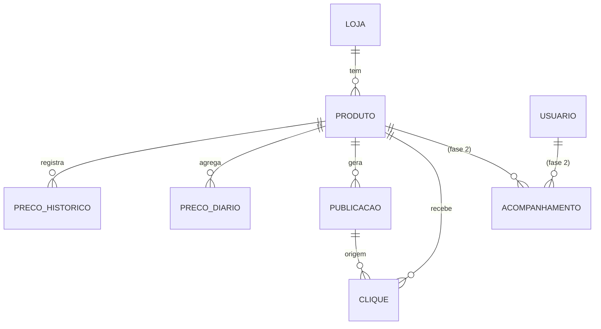

# 04 — Modelo de Dados

Entidades, campos, relacionamentos, índices e **política de retenção do histórico**. Decisão central: guardar preço em **centavos**, gravar histórico **só quando muda** e **downsamplear** o histórico antigo — o banco cresce devagar e o gráfico do site segue rápido. Nomes de entidades são canônicos (ver `CLAUDE.md`).

## Diagrama de entidades (MVP)

## Entidades (MVP)

### Loja
Representa uma loja/marketplace integrada.

| Campo | Tipo | Notas |
|-------|------|-------|
| id | serial PK | |
| nome | text | "Shopee", "AliExpress" |
| slug | text unique | "shopee", "aliexpress" |
| ativo | bool | desliga a loja sem apagar dados |
| config | jsonb | credenciais referenciadas por env, tracking id, limites |
| criado_em | timestamptz | |

### Produto
Um produto monitorado, **sempre de uma variação específica** quando a loja distingue por SKU.

| Campo | Tipo | Notas |
|-------|------|-------|
| id | serial PK | |
| loja_id | int FK → Loja | |
| id_externo | text | id do produto na loja |
| variacao_externa | text null | SKU/tamanho/cor; parte da chave lógica |
| url_canonica | text | link limpo do produto |
| titulo | text | |
| categoria | text | ex.: "tenis", "relogio-gps", "fone", "roupa", "acessorio" |
| imagem_url | text null | |
| preco_atual_centavos | int null | cache do último preço visto |
| disponivel | bool | último estado de disponibilidade |
| preco_referencia_centavos | int null | cache do preço de referência calculado |
| ativo | bool | pausado/removido não apaga histórico |
| cooldown_ate | timestamptz null | não republicar antes disso |
| prioridade_coleta | smallint | usado pela frequência adaptativa |
| visto_em | timestamptz | último check bem-sucedido (heartbeat) |
| criado_em | timestamptz | |
| atualizado_em | timestamptz | |

Chave lógica única: **(loja_id, id_externo, variacao_externa)**.

### PrecoHistorico
Série de preços. **Um registro só é inserido quando o preço muda** (+ 1 "heartbeat" por dia para marcar que o produto continua vivo).

| Campo | Tipo | Notas |
|-------|------|-------|
| id | bigserial PK | |
| produto_id | int FK → Produto | |
| preco_centavos | int | **preço base (sem cupom)** — série canônica; nunca float |
| disponivel | bool | preço de item esgotado não entra no cálculo de queda |
| cupom_codigo | text null | cupom conhecido via API, se houver (bônus, não entra no cálculo) |
| preco_com_cupom_centavos | int null | preço final com o cupom acima, se conhecido via API |
| coletado_em | timestamptz | |

Partição sugerida: **por mês** (`coletado_em`), para arquivar/soltar meses antigos barato (escala; não obrigatório no MVP).

### PrecoDiario (downsample)
Agregado diário por produto, usado pelo **gráfico do site** e para manter o histórico "para sempre" sem inchar.

| Campo | Tipo | Notas |
|-------|------|-------|
| produto_id | int FK → Produto | |
| dia | date | |
| preco_min_centavos | int | |
| preco_max_centavos | int | |
| preco_fechamento_centavos | int | último do dia |
| PK | (produto_id, dia) | |

### Publicacao
Cada oferta publicada no canal (também alimenta a página de "maiores quedas").

| Campo | Tipo | Notas |
|-------|------|-------|
| id | serial PK | |
| produto_id | int FK → Produto | |
| canal | text | "telegram" (plugável) |
| preco_no_post_centavos | int | |
| preco_referencia_centavos | int | |
| percentual_queda | numeric(5,2) | calculado **só sobre o preço base** |
| nivel | text | "boa_oferta" (10–20%) ou "queda_forte" (≥20%) |
| cupom_codigo | text null | cupom exibido como bônus (não afeta `percentual_queda`) |
| preco_com_cupom_centavos | int null | preço final com cupom, se houver |
| cupom_validado_em | timestamptz null | quando o cupom foi validado via API antes de publicar |
| link_afiliado | text | com sub_id de origem |
| status | text | "publicada", "falha" |
| mensagem_id | text null | id da mensagem no canal |
| publicado_em | timestamptz | |

### Clique
Clique **anonimizado** no botão "Comprar" (canal ou site). LGPD: sem dado pessoal identificável.

| Campo | Tipo | Notas |
|-------|------|-------|
| id | bigserial PK | |
| produto_id | int FK → Produto | |
| publicacao_id | int FK → Publicacao null | null se veio de página do site sem post |
| origem | text | "canal", "site" |
| sub_id | text | sub-ID/tracking enviado ao programa |
| criado_em | timestamptz | |
| ip_hash | text null | hash salgado, só para deduplicar/antiabuso; **A CONFIRMAR** se necessário à luz da LGPD |
| ua_hash | text null | idem |

> **Privacidade:** Clique **não** referencia usuário. Nada nas páginas públicas nem no canal permite inferir quem acompanha o quê.

## Entidades da fase 2 (não implementar no MVP)

### Usuario
| Campo | Tipo | Notas |
|-------|------|-------|
| id | serial PK | |
| telegram_user_id | bigint unique | único dado pessoal; base legal + política de privacidade |
| criado_em | timestamptz | |
| apagado_em | timestamptz null | soft-delete para `/apagardados` |

### Acompanhamento
Liga usuário ↔ produto (rastreador pessoal). **Limite proposto: 50 produtos ativos por usuário** (RF/FDM-01).

| Campo | Tipo | Notas |
|-------|------|-------|
| id | serial PK | |
| usuario_id | int FK → Usuario | |
| produto_id | int FK → Produto | |
| preco_alvo_centavos | int null | alerta se cair abaixo |
| ativo | bool | |
| criado_em | timestamptz | |

Único: (usuario_id, produto_id).

## Índices principais

- `Produto (loja_id, id_externo, variacao_externa)` único.
- `Produto (ativo, prioridade_coleta)` — seleção da fila de coleta.
- `PrecoHistorico (produto_id, coletado_em desc)` — leitura da série e do preço de referência.
- `PrecoDiario (produto_id, dia)` — gráfico.
- `Publicacao (publicado_em desc)` — página de maiores quedas.
- `Clique (produto_id, criado_em)` e `Clique (origem, criado_em)` — métricas.
- Fase 2: `Acompanhamento (produto_id, ativo)` e `(usuario_id, ativo)`.

## Política de retenção do histórico

Decisão em `docs/decisoes/0006-guardar-historico-de-precos.md`.

1. **Gravação por variação (delta):** só insere `PrecoHistorico` quando `preco_centavos` muda em relação ao último do mesmo produto/variação; caso contrário, atualiza `Produto.visto_em`. Garante ≥ 1 registro por dia (heartbeat) para o produto não "sumir" do gráfico.
2. **Resolução cheia recente:** mantém `PrecoHistorico` completo por **~90 dias**. (Parâmetro configurável.)
3. **Downsampling:** um job diário agrega em `PrecoDiario` (min/max/fechamento). Registros de `PrecoHistorico` mais antigos que 90 dias podem ser **removidos** — o gráfico de longo prazo usa `PrecoDiario`.
4. **Nunca apaga `PrecoDiario`:** é o ativo estratégico de longo prazo (barato: 1 linha/produto/dia).
5. **Escala:** particionar `PrecoHistorico` por mês; arquivar/soltar partições antigas após o downsampling.

**Estimativa de volume:** com histórico por delta, ~2–3 linhas/produto/dia. 1.000 produtos ≈ ~100 MB/ano em `PrecoHistorico`; `PrecoDiario` ≈ 1 linha/produto/dia (irrisório). No MVP (lançando com ~200–400 produtos, crescendo para ~800–1.500), ordem de dezenas a centenas de MB/ano. Ver `docs/03` (infra) e a conta em discussão de projeto.
