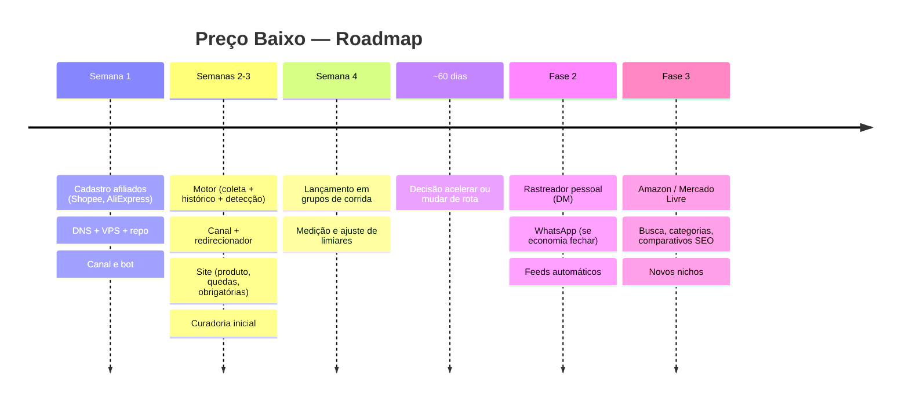

# 09 — Roadmap e Métricas

Cronograma do MVP em 4 semanas (com o site incluído), fases futuras, métricas de sucesso (canal + site) e o critério para, aos ~60 dias, decidir **acelerar ou mudar de rota**. Nicho do MVP: **corrida**. Saída do MVP: **canal do Telegram + site**, alimentados por um motor único.

## MVP — 4 semanas

O site **cabe** no MVP porque compartilha o motor e o banco; o esforço extra é de páginas de leitura. Escopo enxuto: página de produto, maiores quedas e páginas obrigatórias.

### Semana 1 — Cadastro e fundação
- Cadastrar nos programas de afiliados **Shopee** e **AliExpress**; obter chaves (App ID/Key, App Key/Secret, Tracking ID).
- **Resolver os "A CONFIRMAR" de integração** (endpoints BR, sub-id, rate limits, regras de exibição/redirecionamento, marcas restritas) — ver `docs/05` e `docs/questoes-em-aberto.md`.
- Registrar **domínio** e apontar DNS; preparar VPS (Docker, proxy/HTTPS).
- Esqueleto do repositório conforme estrutura em `CLAUDE.md`.
- Criar o **canal do Telegram** e o bot no @BotFather.

### Semanas 2–3 — Construção
- **Motor:** adaptadores Shopee/AliExpress (buscar produto, consultar preço, gerar link de afiliado), coleta agendada (Celery + Beat), histórico (delta) + downsampling diário.
- **Detector de queda real** com os critérios de `docs/05` (limiar %/R$, variação, disponibilidade, cupom, cooldown, anti-flap).
- **Publicador** no canal (formato de post de `docs/06`) + redirecionador de cliques (conforme regra do programa).
- **Site (Next.js):** página de produto com gráfico, `/quedas`, páginas obrigatórias, SEO básico (sitemap, robots, OG, dados estruturados), HTTPS.
- **Curadoria inicial:** admin adiciona ~200–400 produtos de corrida via `/add`, começando a formar histórico. Meta de crescer para **~800–1.500** produtos nas semanas seguintes para sustentar o volume de posts (ADR 0011); se a curadoria manual virar gargalo, antecipar os feeds automáticos (fase 2).
- Backups, logs e monitoramento básicos (`docs/03`).

### Semana 4 — Lançamento e medição
- Deixar o histórico "maturar" alguns dias para o preço de referência ficar confiável.
- **Lançar** o canal para **amigos e grupos de corrida** (comunidades, assessorias).
- Medir tudo (ver métricas abaixo).
- Ajustar limiares de queda e frequência conforme dados reais.

> **Premissa:** dá para maturar histórico suficiente em poucos dias para as primeiras ofertas confiáveis. Se o preço de referência precisar de mais tempo, começar a curadoria já na Semana 2 mitiga o risco.

## Fases futuras

- **Fase 2 — Rastreador pessoal (DM):** usuário manda link, bot vigia só para ele e avisa quando cair. Inclui limite de **50 produtos/usuário**, `/apagardados` e fila de push com controle de taxa. Reavaliar **WhatsApp** (só se a economia fechar: comissão por alerta > custo de template Meta).
- **Fase 2/3 — Feeds automáticos de catálogo:** Shopee `productOfferV2` / hot products AliExpress, por categoria, reduzindo curadoria manual.
- **Fase 3 — Mais lojas:** Amazon (Creators API, quando houver vendas qualificadas) e Mercado Livre (se surgir API oficial).
- **Fase 3 — Site:** busca, categorias e **páginas de comparativo** para SEO; o **canal de promoções** também aponta para o site.
- **Fase 3 — Mais nichos** além de corrida (mesmo motor, novo catálogo/canal/seção).

## Métricas de sucesso

### MVP (canal + site)
| Métrica | Como medimos |
|---------|--------------|
| **Inscritos no canal** | Telegram. |
| **Produtos no catálogo** | Contagem de `Produto` ativos. |
| **Posts publicados** | Contagem de `Publicacao`. |
| **Cliques por origem** | Tabela `Clique` (`origem` = canal/site). |
| **Visitas ao site** | Analytics com foco em privacidade (`docs/07`). |
| **Vendas / comissões por origem** | Relatórios de conversão dos programas, cruzados por **sub-id**. |
| **Taxa de queda falsa** | Ofertas publicadas que não eram queda real (monitorar qualidade — alvo ~0). |

### Fase 2 (adiciona)
- **Usuários ativos**, **produtos monitorados por usuário**, **alertas enviados** e taxa de conversão de alerta → clique → venda.

### Indicadores derivados
- **CTR do canal** (cliques / alcance do post).
- **Conversão** (vendas / cliques) por origem.
- **Comissão por post** e **comissão por inscrito**.

## Critério de decisão aos ~60 dias (acelerar ou mudar de rota)

Após ~60 dias do lançamento, avaliar o **risco #1** (`docs/01`): existe tração real?

**Sinais de ACELERAR** (investir em fase 2, mais nichos, feeds):
- Crescimento **orgânico** de inscritos (boca a boca dentro das comunidades de corrida).
- **CTR** saudável e **cliques recorrentes** (as pessoas voltam).
- **Vendas/comissões** consistentes atribuídas ao canal e/ou site.
- Tráfego de **SEO** começando a aparecer nas páginas de produto/quedas.

**Sinais de MUDAR DE ROTA** (ajustar nicho, canal ou proposta):
- Inscritos estagnados mesmo com boas ofertas.
- Cliques sem conversão (comissão perto de zero) → problema de loja/nicho/economia.
- Fluxo de ofertas reais insuficiente (canal fica mudo) → nicho estreito demais ou catálogo pequeno.
- Esforço de curadoria/operação alto demais para o retorno.

**Premissa:** metas numéricas específicas (ex.: X inscritos, Y comissões) serão definidas na Semana 4 com base no tamanho real das comunidades alcançadas — ver `docs/questoes-em-aberto.md`.

## Resumo visual do roadmap

