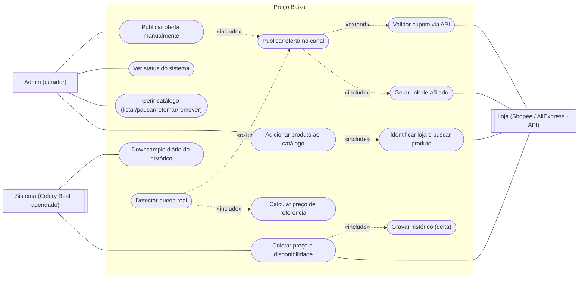
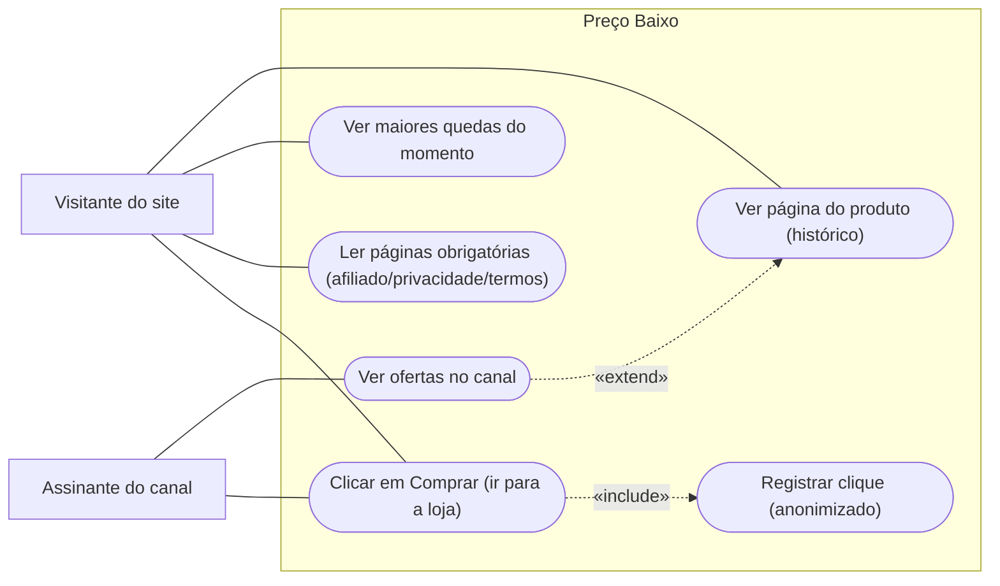

# 01 — Casos de uso

Visão funcional: quem interage com o Preço Baixo e o que cada um consegue fazer. Inclui **atores não-humanos** — o agendador (Celery Beat) dispara a coleta e a detecção sozinho, e as **APIs das lojas** são atores externos que o sistema consulta. Zero implementação aqui; os "como" estão em [06 — sequência](06-sequencia.md).

> Mermaid não tem diagrama nativo de caso de uso; usa-se `flowchart` com nós "estádio" `([...])` para os casos e `---` (linha sem seta) para associação ator↔caso, como a notação UML pede. Dividido em dois diagramas para leitura — a mesma fronteira de sistema.

## Diagrama A — Curadoria e motor (admin + jobs)

## Diagrama B — Consumo público (canal + site)

## Leitura das relações que não são óbvias

- **`«include»` = sempre acontece dentro do caso base.**
  - *Adicionar produto* **inclui** *Identificar loja e buscar produto*: não dá para cadastrar sem antes reconhecer a loja e puxar título/variação/preço pelo link (RF-01).
  - *Coletar preço* **inclui** *Gravar histórico (delta)*: toda coleta bem-sucedida termina gravando — seja um novo `PrecoHistorico` (preço mudou) seja o heartbeat de "visto em" (RF-05). O "delta" está no próprio caso: não grava linha nova se o preço não mudou.
  - *Detectar queda real* **inclui** *Calcular preço de referência*: sem a referência (mediana ~30 dias da **mesma variação**) não há como afirmar que caiu (RF-07).
  - *Publicar oferta* **inclui** *Gerar link de afiliado*: um post sem link de afiliado não monetiza — é parte obrigatória do post (RF-10, RF-11).
  - *Clicar em Comprar* **inclui** *Registrar clique (anonimizado)*: o redirecionador sempre registra o clique (origem canal/site, sub_id) **antes** do 302 para a loja (RF-21). Registro é anonimizado — LGPD (RF-24).

- **`«extend»` = condicional, só às vezes.**
  - *Detectar queda real* **estende** *Publicar oferta*: detectar roda em toda coleta, mas **só publica quando a queda é real** — disponível, mesma variação, ≥ tier de 10%/20% e ≥ R$ 15, fora do cooldown e persistente por ≥ 2 checagens ([`../05-integracoes.md`](../05-integracoes.md)). É o ponto onde a regra **bloqueia**: falhou qualquer condição, não publica (ver os `alt` em [06 — sequência](06-sequencia.md)).
  - *Publicar oferta* **estende** *Validar cupom via API*: cupom só é validado (e exibido como bônus) **se houver** cupom conhecido via API oficial no momento da publicação (ADR 0010). Sem cupom, o post sai só com o preço base — por isso `extend`, não `include`.
  - *Ver ofertas no canal* **estende** *Ver página do produto*: o botão "Ver histórico" leva do canal ao site, mas é opcional — o assinante pode só ver a oferta e ir direto comprar (RF-12).

- **Atores não-humanos.** *Celery Beat* dispara *Coletar preço*, *Detectar queda real* e o *Downsample diário* sem ninguém pedir — por isso são casos de uso, não tarefas escondidas. As *APIs das lojas* participam como ator externo dos casos que dependem delas (buscar produto, coletar preço, gerar link, validar cupom) — se a loja não responde, esses casos degradam (ver ramo de erro em [06](06-sequencia.md)).

- **Publicação manual vs. automática.** *Publicar oferta manualmente* (RF-15, comando `/publicar`) e a publicação automática compartilham o mesmo *Publicar oferta no canal* — mesmo formato, mesmo aviso de afiliado, mesmo link. O bypass do admin pula a detecção, **não** o formato obrigatório.

## Fora do escopo (fase 2)

O **rastreador pessoal por DM** (usuário manda link, é avisado quando aquele produto cair — FDM-01) adicionaria o ator *Usuário* e casos como *Monitorar produto*, *Definir preço-alvo* e *Apagar meus dados* (`/apagardados`, LGPD). **Não faz parte do MVP** e não está modelado aqui — ver [`../06-experiencia-do-bot.md`](../06-experiencia-do-bot.md).
