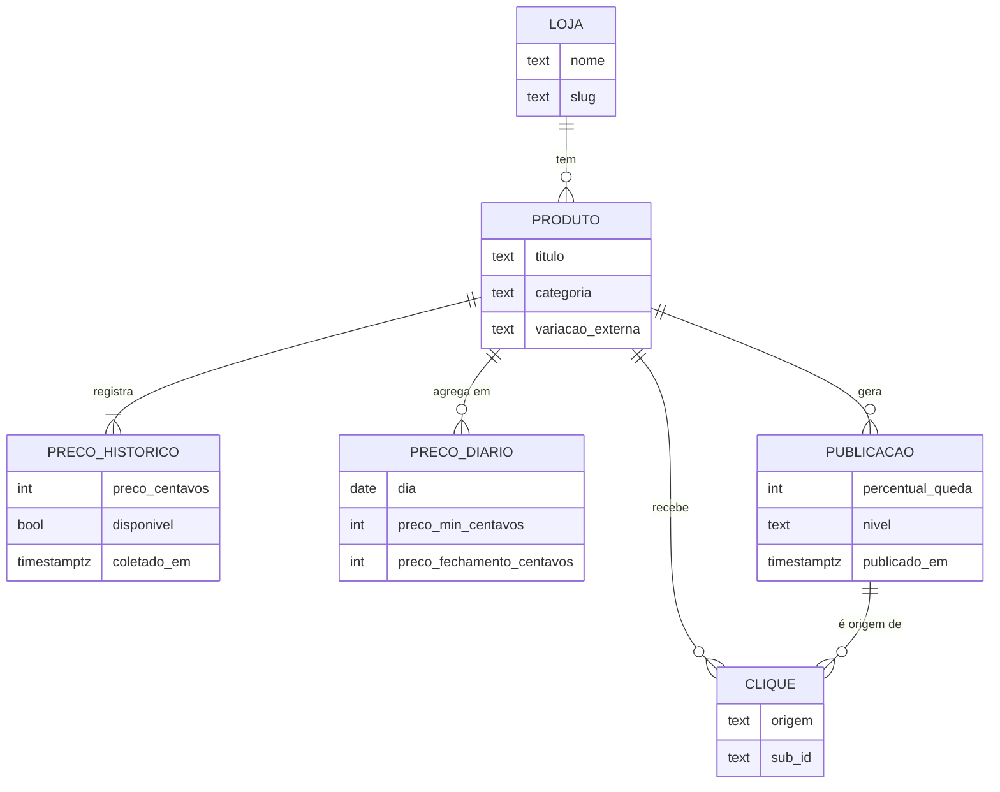
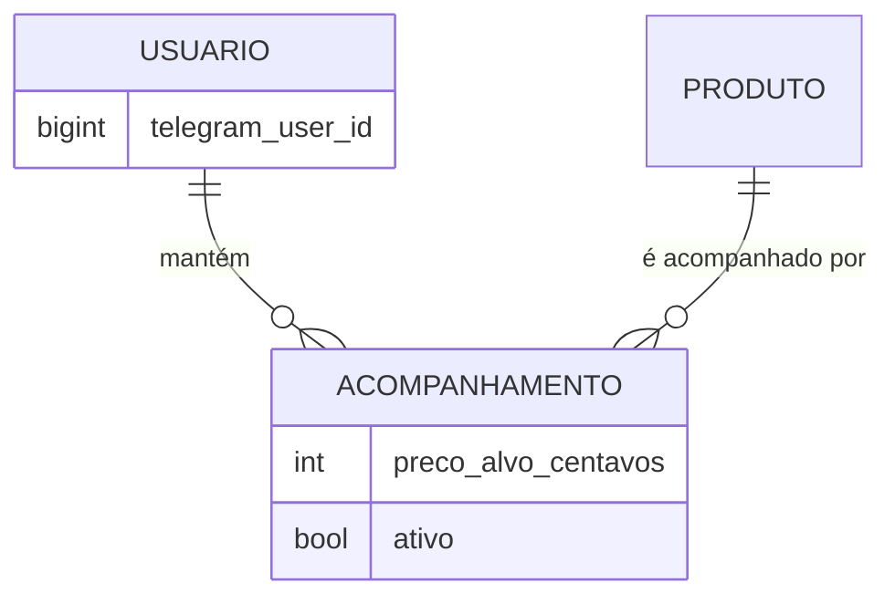

# 02 — MER (conceitual)

As entidades do domínio e como se relacionam, **sem tipos nem colunas** — para entender o domínio sem precisar ler schema. Os campos completos estão no [03 — DER](03-der.md); a lista campo a campo, no [07 — dicionário](07-dicionario-de-dados.md). Nomes de entidade são canônicos ([`../04-modelo-de-dados.md`](../04-modelo-de-dados.md)).

> No `erDiagram`, o nome da entidade é identificador (sem espaço/acento): `PRECO_HISTORICO`. Só 2–4 atributos por entidade aqui — o suficiente para reconhecê-la.

## Fase 2 (não no MVP)

Entidades do rastreador pessoal, mostradas separadas para deixar claro que **não entram no MVP**:

## Leitura rápida (cardinalidades que importam)

- **`PRODUTO ||--|{ PRECO_HISTORICO` (um ou muitos, não zero).** Todo produto tem **pelo menos um** registro de preço: o 1º `PrecoHistorico` é criado no ato do cadastro (ver [06 — sequência, fluxo 1](06-sequencia.md)) e o heartbeat diário garante ≥ 1 registro/dia. Um produto sem nenhum preço não deveria existir.
- **`PRODUTO ||--o{ PRECO_DIARIO` (zero ou muitos).** O `PrecoDiario` é o **downsample** gerado por um job diário — um produto recém-cadastrado ainda não tem nenhuma linha diária até o job rodar. Coexiste com `PrecoHistorico` de propósito: histórico cheio por ~90 dias, agregado diário "para sempre" (retenção em [`../04-modelo-de-dados.md`](../04-modelo-de-dados.md)).
- **`PUBLICACAO ||--o{ CLIQUE` e `PRODUTO ||--o{ CLIQUE` ao mesmo tempo.** Um clique referencia **sempre** o produto, mas a publicação é **opcional**: clique vindo de uma página do site (sem post associado) tem `publicacao_id` nulo. Por isso `Clique` se liga às duas.
- **`CLIQUE` não se relaciona com nenhum usuário.** De propósito — privacidade por padrão. Nada nas páginas públicas nem no canal permite inferir quem acompanha o quê (RF-19). É por isso que, mesmo na fase 2, `Clique` **não** ganha FK para `Usuario`.
- **Nenhuma relação direta `LOJA`↔`PUBLICACAO`/`CLIQUE`.** A loja se alcança sempre **via `Produto`** (`Produto.loja_id`). Não se duplica a loja em publicação/clique — quem precisa da loja de um post navega `Publicacao → Produto → Loja`.
- **`variacao_externa` faz parte da identidade do `Produto`.** A chave lógica é `(loja_id, id_externo, variacao_externa)`: **cada variação (SKU/tamanho/cor) é um `Produto` distinto**, porque a regra-mãe é nunca comparar preço entre variações diferentes. Isso é decisão de modelagem, detalhada no [03 — DER](03-der.md).
