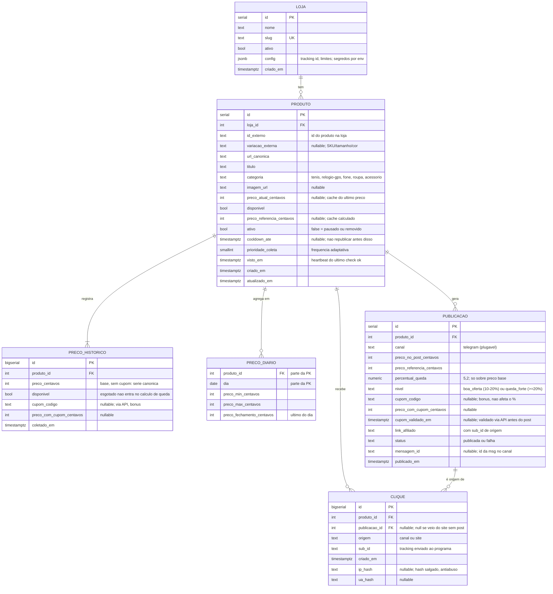
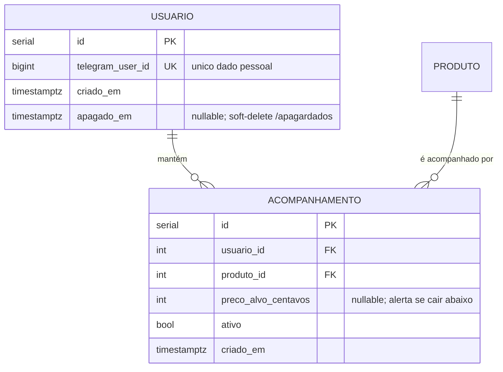

# 03 — DER (lógico)

O [MER](02-mer.md) com tipos, chaves e restrições — o schema **PostgreSQL** do MVP, pronto para virar migração. Tipos são os do PostgreSQL. Regras transversais: **preço sempre em centavos (`int`), nunca float**; timestamps em `timestamptz` (UTC); soft-delete via `ativo` (nunca apagar histórico).

> No `erDiagram`, comentário de atributo **precisa de aspas** (`"nullable"`), senão o bloco quebra silenciosamente. `PK`/`FK`/`UK` marcam o que o schema **de fato** impõe.

## Notas de mapeamento (decisões de implementação e o porquê)

- **Chave única composta `Produto (loja_id, id_externo, variacao_externa)`** — é a chave lógica de negócio; o `id serial` é só a chave técnica. A constraint `UK` composta é o que **impede fisicamente** cadastrar a mesma variação duas vezes e sustenta a regra-mãe "comparar sempre a mesma variação". `variacao_externa` é anulável (loja que não distingue SKU), então a unicidade precisa tratar `NULL` de forma consistente — em PostgreSQL, `NULL` não colide com `NULL` num índice único comum; se a regra for "só um produto sem variação por (loja, id_externo)", usar índice único parcial ou `NULLS NOT DISTINCT` (PG 15+). **Confirmar na migração.**
- **`PrecoDiario` tem PK composta `(produto_id, dia)`** e **não** tem `id` próprio — é 1 linha por produto por dia; a própria combinação já é única e é o índice do gráfico.
- **`preco_*_centavos` é `int`, nunca `numeric`/`float`.** Dinheiro em centavos inteiro elimina erro de arredondamento na comparação de queda. O **único** `numeric` é `percentual_queda (5,2)` — é percentual, não dinheiro.
- **Campos derivados / cache (invariante a manter):**
  - `Produto.preco_atual_centavos`, `Produto.disponivel` e `Produto.visto_em` são **cache** do último `PrecoHistorico`. Toda coleta atualiza os dois lados na **mesma transação** — se divergirem, o `PrecoHistorico` é a verdade.
  - `Produto.preco_referencia_centavos` é **cache** da referência calculada do histórico (mediana ~30 dias). Recalcular quando o histórico muda; a série em `PrecoHistorico` é a fonte.
  - `Publicacao.percentual_queda` é derivado de `preco_no_post` vs `preco_referencia` **base vs base** (cupom nunca entra) — gravado no momento do post e **imutável** depois (registro histórico do que foi publicado).
- **Enums guardados como `text`, não tipo `enum` nem `int`** (`nivel`, `status`, `origem`, `canal`): mantém plugabilidade (novo canal/nível sem migração de tipo) e legibilidade no banco. A validação do domínio de valores vive na aplicação — os valores válidos estão no [07 — dicionário](07-dicionario-de-dados.md).
- **`Loja.config jsonb`** guarda tracking id, limites de rate e **referências** a segredos — **nunca o segredo em si** (tokens/keys ficam em variáveis de ambiente, RNF-09).
- **Particionamento de `PrecoHistorico` por mês (`coletado_em`)** é sugerido para escala (arquivar/soltar meses antigos após o downsample), **não obrigatório no MVP**. Ver retenção em [`../04-modelo-de-dados.md`](../04-modelo-de-dados.md).

## Índices (além dos PK/UK acima)

- `Produto (ativo, prioridade_coleta)` — seleção da fila de coleta adaptativa.
- `PrecoHistorico (produto_id, coletado_em DESC)` — leitura da série e cálculo da referência.
- `PrecoDiario (produto_id, dia)` — gráfico (já coberto pela PK).
- `Publicacao (publicado_em DESC)` — página de maiores quedas.
- `Clique (produto_id, criado_em)` e `Clique (origem, criado_em)` — métricas por produto e por origem.

## Zona cinzenta — confirmar antes de implementar

- **`Produto.ativo` (bool) não distingue "pausado" de "removido".** Os comandos `/pausar` e `/remover` ([`../06-experiencia-do-bot.md`](../06-experiencia-do-bot.md)) sugerem dois estados, mas ambos apenas setam `ativo = false`. Se a distinção precisar sobreviver (ex.: relatório de "removidos" vs "pausados", ou impedir `/retomar` de um removido), o schema precisa de um campo `status` (enum text) no lugar do bool. Ver [05 — estados](05-estados.md). **Decisão em aberto.**
- **`Clique.ip_hash`/`ua_hash`** estão marcados `A CONFIRMAR` à luz da LGPD em [`../04-modelo-de-dados.md`](../04-modelo-de-dados.md) — só manter se forem de fato necessários para deduplicar/antiabuso; senão, remover (coletar o mínimo, RF-24).

## Fase 2 (não no MVP)

Único: `Acompanhamento (usuario_id, produto_id)`. Limite proposto: **50 produtos ativos por usuário** (FDM-01) — regra de aplicação, não constraint de schema.
