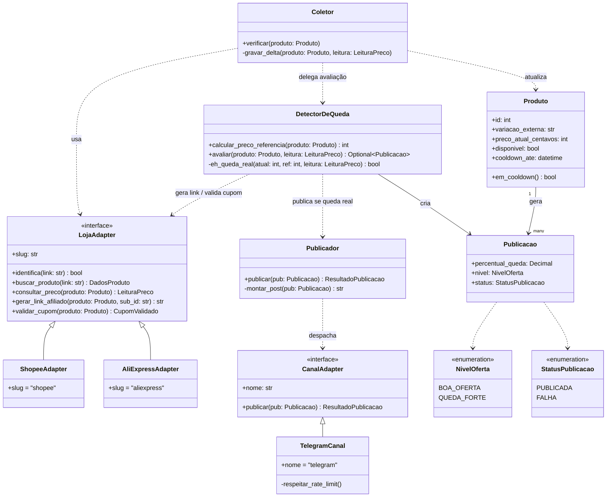

# 04 — Diagrama de classes

O que este diagrama documenta é o princípio-mãe da arquitetura: **loja e canal são adaptadores plugáveis**, e a regra de "queda real" mora num lugar só (o detector). Não é um CRUD anêmico — há comportamento de verdade nas interfaces e no detector. As **entidades de dados** (`Produto`, `PrecoHistorico`, ...) são modeladas no [DER](03-der.md); aqui aparecem só as classes com comportamento e as poucas entidades que elas manipulam.

> **Zona cinzenta:** o projeto está em planejamento, **sem código**. Os nomes de método vêm da arquitetura documentada ([`../03-arquitetura.md`](../03-arquitetura.md), que fixa `buscar_produto`, `consultar_preco`, `gerar_link_afiliado`) — são **propostos**, confirmar quando o código existir. Convenção Python: `snake_case`, interfaces como classes base abstratas (`ABC`).

## Por que os métodos são esses

Cada método público existe porque uma regra concreta precisa de um lugar único para viver:

- **`LojaAdapter` é a interface comum a toda loja** — o motor nunca fala "Shopee" ou "AliExpress" direto, só `LojaAdapter`. É o que permite adicionar loja sem tocar no núcleo (RNF-04).
  - `identifica(link)` — usado no `/add`: descobre qual adaptador dá conta daquele link (RF-01).
  - `buscar_produto(link)` — extrai id externo, título, **variação**, imagem, preço no cadastro.
  - `consultar_preco(produto)` — a coleta periódica; retorna preço **e disponibilidade por variação** (RF-03, RF-06).
  - `gerar_link_afiliado(produto, sub_id)` — só chamado no momento de publicar/redirecionar; o `sub_id` carrega a origem (canal/site) para rastrear a venda (RF-21).
  - `validar_cupom(produto)` — separado de propósito: cupom só vira bônus no post **se validado via API oficial no momento da publicação** (ADR 0010). Método próprio porque pode não existir na loja (**A CONFIRMAR** se Shopee/AliExpress expõem validade/preço do cupom).
- **`CanalAdapter.publicar(pub)`** — mesma lógica de plugabilidade para o lado da saída: hoje `TelegramCanal`, amanhã WhatsApp/e-mail sem reescrever o motor. `respeitar_rate_limit()` é privado porque é uma preocupação interna do adaptador Telegram (RNF-05), não do detector.
- **`DetectorDeQueda` é o coração — e a regra de "queda real" mora só aqui.**
  - `calcular_preco_referencia(produto)` — a mediana ~30 dias da **mesma variação** (RF-07). Um lugar só para não haver duas definições de "preço normal".
  - `avaliar(...)` retorna `Optional[Publicacao]`: **`None` quando não é queda real** (o caminho que bloqueia — ver os `alt` em [06 — sequência](06-sequencia.md)), uma `Publicacao` quando é.
  - `eh_queda_real(...)` é privado e concentra todas as portas: disponível, mesma variação, tier ≥10%/20% e ≥ R$ 15, fora do cooldown, persistente por ≥ 2 checagens.
- **`Produto.em_cooldown()`** é comportamento **computado**, não coluna: retorna `cooldown_ate > agora`. Fica no modelo porque o detector pergunta isso o tempo todo, e não faz sentido duplicar a comparação em vários lugares. Ver [05 — estados](05-estados.md).

## Composição vs. associação (a distinção que importa)

- `Produto "1" --> "many" Publicacao` é **associação** (`-->`), não composição: uma `Publicacao` é registro histórico do que foi publicado — **sobrevive** ao produto ser pausado/removido (o histórico nunca é apagado). Apagar o produto **não** deve apagar suas publicações.
- Nenhuma classe é raiz de agregado que "possua" outra no sentido forte (composição `*--`): `PrecoHistorico`, `Publicacao` e `Clique` têm ciclo de vida próprio (retenção, métricas) e não nascem/morrem junto com o `Produto`. Por isso todas as ligações são associação/dependência, não composição — o oposto seria dizer que apagar um produto apaga seu histórico, o que a regra proíbe.
