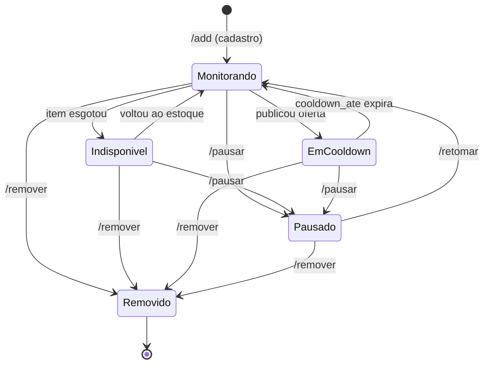

# 05 — Diagrama de estados

O ciclo de vida de **monitoramento** de um `Produto` — a resposta à pergunta "quando este produto **pode** ser publicado no canal?". Vale a pena como máquina de estados porque as transições são **restritas**: não é toda transição que é válida (não se publica em cooldown, não se coleta o que está removido). Toda transição ausente é uma proibição implícita.

## Estados persistidos vs. computados

Distinção central — nem todo "estado" acima é uma coluna no banco:

- **Persistido** — o estado está guardado num campo do `Produto`:
  - **`Pausado` / `Removido`** vêm de `Produto.ativo = false`. **Só a coluna `ativo` existe hoje** — ver a zona cinzenta abaixo.
- **Computado** — derivado de um campo, **não** vira coluna de estado nova:
  - **`EmCooldown`** = `cooldown_ate > agora` (método `Produto.em_cooldown()`, ver [04 — classes](04-classes.md)). Não há coluna "status = em_cooldown"; criar uma seria duplicar `cooldown_ate` e arriscar divergência.
  - **`Indisponivel`** = `disponivel = false` na última leitura. É o reflexo do estoque na loja, não uma decisão nossa.
  - **`Monitorando`** é o estado "normal": `ativo = true`, `disponivel = true`, `cooldown_ate` no passado/nulo. É o **único estado em que uma oferta pode ser publicada**.

## Regras por estado (o que só vale ali)

- **`Monitorando`** — único estado publicável. A coleta roda na frequência adaptativa e a detecção pode disparar uma publicação.
- **`EmCooldown`** — a coleta e a gravação de histórico **continuam** (o preço segue sendo acompanhado), mas **nenhuma publicação sai** enquanto durar o cooldown (RF-14, "NUNCA republicar dentro do cooldown"). Evita spam/re-post da mesma oferta. Premissa: 7 dias.
- **`Indisponivel`** — a coleta continua (para saber quando volta), mas preço de item esgotado **não entra no cálculo de queda** e não gera post (RF-09). Volta a `Monitorando` quando o estoque retorna.
- **`Pausado`** — a coleta **para**; histórico é preservado. Sai só por `/retomar`.
- **`Removido`** — estado terminal. A coleta para e o produto some das seleções, mas **o histórico nunca é apagado** (soft-delete). Não há transição de saída: o modelo atual não prevê "des-remover".

## Transições proibidas (por serem ausentes)

- Não há `EmCooldown → publica de novo`: publicar exige passar por `Monitorando` (cooldown expirado).
- Não há `Indisponivel → EmCooldown/publicação`: item esgotado nunca gera oferta.
- Não há `Removido → *`: uma vez removido, só re-cadastro (`/add`) traria o produto de volta — e isso é um **novo** ciclo a partir de `[*]`, não uma transição de saída de `Removido`.
- `EmCooldown` e `Indisponivel` são ortogonais na prática (um produto pode estar esgotado logo após publicar); o diagrama os trata como estados do mesmo nível porque **ambos apenas bloqueiam publicação** — para o efeito que importa (publicável ou não), a composição não muda a regra.

## Zona cinzenta — confirmar antes de implementar

**`Pausado` e `Removido` não são distinguíveis no modelo atual.** Ambos são `Produto.ativo = false`; a diferença hoje é só de intenção do admin, não persistida. Consequências a decidir (ver também [03 — DER](03-der.md)):

- `/retomar` de um produto **removido** deveria ser bloqueado? Com só o bool, o sistema não sabe distinguir.
- Se a distinção precisar existir, trocar `ativo bool` por um campo `status` (enum text: `ativo` / `pausado` / `removido`) — aí `Pausado` e `Removido` viram estados **persistidos** de verdade, e o diagrama acima passa a espelhar 1:1 a coluna.

Enquanto isso não se decidir, trate `Pausado`/`Removido` como **o mesmo estado persistido (`inativo`)** com dois rótulos de intenção.
