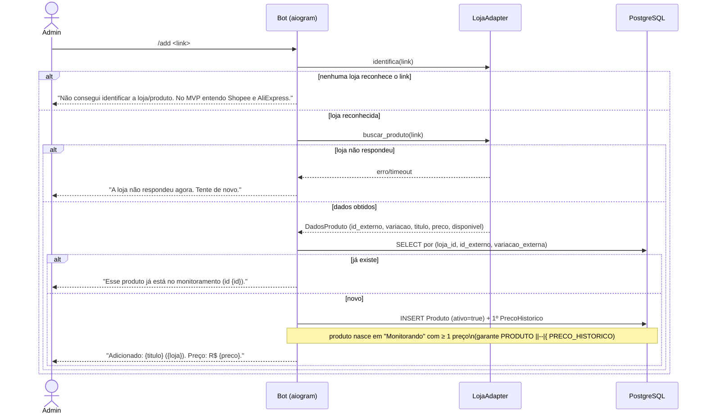

# 06 — Diagramas de sequência

Quatro fluxos escolhidos por serem **propensos a erro** ou **amarrados a uma regra crítica** — não cobertura de todo comando. O fluxo 3 (detecção de queda real) é a joia da coroa: é onde uma checagem fora de ordem ou uma condição esquecida vira **queda falsa publicada**, o pior erro do produto (RNF-02).

> **Zona cinzenta:** nomes de método são propostos (arquitetura documentada, sem código ainda — ver [04 — classes](04-classes.md)). Participantes são os componentes reais de [`../03-arquitetura.md`](../03-arquitetura.md). Em `sequenceDiagram`, o texto de `Note` é uma linha só; quebras usam `\n` literal.

## Fluxo 1 — Cadastrar produto (`/add`, curadoria manual)

Propenso a erro nas bordas: link de loja não suportada e produto duplicado. Ambos **bloqueiam** com mensagem de autoatendimento (nunca erro técnico cru — RNF-11).



## Fluxo 2 — Verificar preço (periódico, adaptativo, gravação por delta)

Regra crítica silenciosa: **só grava linha nova quando o preço muda** — senão o banco incha. O erro fácil é gravar sempre.

```mermaid
sequenceDiagram
    participant Beat as Celery Beat
    participant Worker as Worker/Coletor
    participant Adapter as LojaAdapter
    participant DB as PostgreSQL

    Beat->>Worker: enfileira verificar(produto)
    Note over Beat,Worker: só produtos ativos; respeita orçamento\nde chamadas por loja (rate limit)
    Worker->>Adapter: consultar_preco(produto)
    alt loja falhou
        Adapter-->>Worker: erro
        Note over Worker: loga; NÃO altera visto_em;\ntentará de novo (falha de 1 loja não derruba as outras)
    else leitura ok
        Adapter-->>Worker: LeituraPreco (preco_centavos, disponivel) por variação
        alt preço mudou vs. último histórico
            Worker->>DB: INSERT PrecoHistorico (delta)
        else preço igual
            Worker->>DB: UPDATE Produto.visto_em (heartbeat)
        end
        Worker->>DB: atualiza cache (preco_atual, disponivel, visto_em)
        Worker->>Worker: avaliar queda (ver Fluxo 3)
        Worker->>Worker: recalcula prioridade_coleta (cliques/volatilidade)
    end
```

## Fluxo 3 — Detectar queda real e publicar (a joia da coroa)

Toda porta que **bloqueia** a publicação é um `alt` explícito. A ordem importa: as checagens baratas e determinísticas (disponível, variação) vêm antes das caras (referência, validar cupom via API). O `%` da manchete é **sempre base vs base** — cupom nunca entra.

```mermaid
sequenceDiagram
    participant Worker
    participant Detector as DetectorDeQueda
    participant DB as PostgreSQL
    participant Adapter as LojaAdapter
    participant Pub as Publicador
    participant Canal as TelegramCanal

    Worker->>Detector: avaliar(produto, leitura)
    alt indisponível OU fora da mesma variação
        Detector-->>Worker: None (ignora, loga motivo)
    else disponível e mesma variação
        Detector->>DB: histórico da mesma variação (30d)
        Detector->>Detector: calcular_preco_referencia()
        alt queda < 10% OU diferença < R$ 15
            Detector-->>Worker: None (abaixo do tier mínimo)
            Note over Detector: volume vem de ampliar catálogo,\nNUNCA de baixar a régua
        else queda >= 10% e >= R$ 15
            alt em cooldown (cooldown_ate > agora)
                Detector-->>Worker: None (anti-repetição)
            else fora do cooldown
                alt não persistiu por >= 2 verificações
                    Detector-->>Worker: None (anti-flap; aguarda confirmar)
                else queda confirmada
                    Detector->>Detector: nivel = queda_forte se >=20%, senão boa_oferta
                    Detector->>Adapter: gerar_link_afiliado(produto, sub_id="canal")
                    opt cupom conhecido via API
                        Detector->>Adapter: validar_cupom(produto)
                        Note over Detector,Adapter: só entra como BÔNUS se validado agora;\nnão afeta o % (base vs base) — ADR 0010
                    end
                    Detector->>DB: INSERT Publicacao (status=publicada?)
                    Detector->>Pub: publicar(publicacao)
                    Pub->>Canal: sendPhoto + botões (Comprar / Ver histórico)
                    alt canal publicou
                        Canal-->>Pub: mensagem_id
                        Pub->>DB: Publicacao.status=publicada, mensagem_id; Produto.cooldown_ate=+7d
                        Note over Pub,DB: produto entra em "EmCooldown" (ver 05-estados)
                    else falha ao publicar
                        Canal-->>Pub: erro (rate limit / API)
                        Pub->>DB: Publicacao.status=falha
                    end
                end
            end
        end
    end
```

## Fluxo 4 — Registrar clique e redirecionar (canal ou site → loja)

Regra crítica de LGPD e de atribuição: registrar o clique **anonimizado antes** do redirect, e o `sub_id` tem de viajar no link para a comissão ser atribuída à origem certa.

```mermaid
sequenceDiagram
    actor Usuario
    participant Redir as Redirecionador
    participant DB as PostgreSQL
    participant Loja

    Usuario->>Redir: GET /r?produto={id}&origem={canal|site}
    Redir->>DB: INSERT Clique (produto_id, publicacao_id?, origem, sub_id) anonimizado
    Note over Redir,DB: sem usuário; sem dado pessoal identificável (RF-24)\nregistra ANTES do redirect para não perder o clique
    Redir-->>Usuario: HTTP 302 → link de afiliado (com sub_id)
    Usuario->>Loja: abre a loja e (talvez) compra
    Note over Loja,DB: venda/comissão chega depois, via relatório do programa\n(não há callback em tempo real)
```

> **Conformidade (RF-22):** o redirecionador por domínio próprio só é usado **se o programa da loja permitir**; caso contrário, o botão leva ao **link direto do programa** e o clique não passa por nós. Ver [`../08-conformidade.md`](../08-conformidade.md).

## Onde a distinção "bloqueia vs. avisa" aparece

- **Bloqueia (retorna `None`, nada é publicado):** todas as portas do Fluxo 3 — indisponível, variação errada, abaixo do tier, em cooldown, não persistente. É o comportamento por padrão: na dúvida, **não** publica (RNF-02, confiança antes de volume).
- **Avisa sem bloquear (post sai mesmo assim):** o **cupom** e a **mudança de frete grátis** entram como *bônus/observação* no post quando existem, mas **nunca** decidem se a oferta é publicada nem afetam o `%`. Por isso o cupom está num `opt` (opcional), não num `alt` de bloqueio — falha em validar cupom não cancela o post, só remove o bônus.
